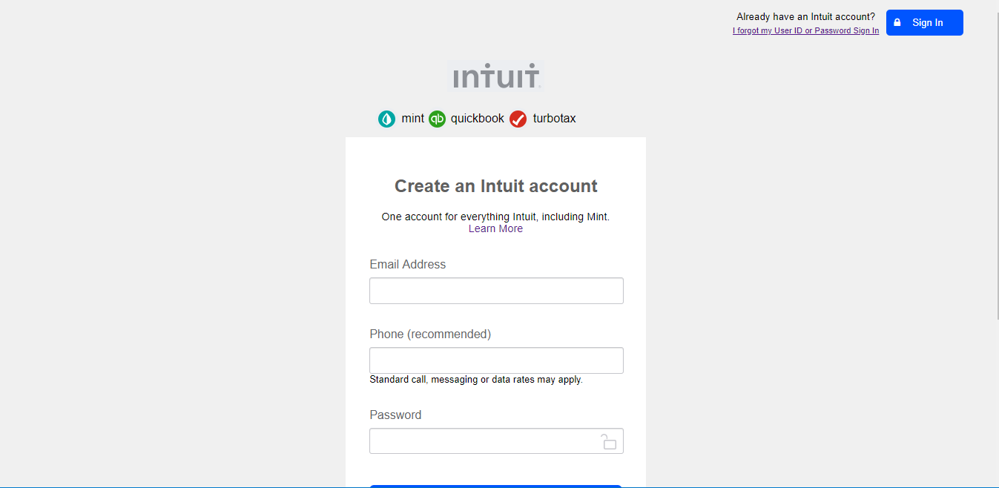

# Mint Sign-Up Page
## This project is a clone of Mint.com Sign-Up Page.

### The essence of the project is to validate the use of HTML5 elements to develop a form. This webpage contains Sign-In button and a form to Sign-Up. The form includes three input elements for email, phone number and password respectively.

### Built With
* HTML5
* CSS3

### Live Demo
[Live Demo Link](https://rawcdn.githack.com/3rkeen/mint-signup-page/440b96f1b88bbc9d2ffa4e5e70046a8e7b2ac6ce/index.html)

### Getting Started
Click once on the [Live Demo Link](https://rawcdn.githack.com/3rkeen/mint-signup-page/440b96f1b88bbc9d2ffa4e5e70046a8e7b2ac6ce/index.html) 

### Authors
👤 Author1

* GitHub:[@github/3rkeen](https://github.com/3rkeen)
* Twitter:[@twitter/3rkeen](https://twitter.com/3rkeen)
* Linkedin:[linkedin/ErkinSheraliev](https://www.linkedin.com/in/erkin-sheraliev-9122631a0/)

👤 Author2
* GitHub:[@github/Zubenna](https://github.com/Zubenna)
* Twitter:[@twitter/zubenna](https://twitter.com/zubenna)
* Linkedin:[linkedin/NnamdiEmelu](https://www.linkedin.com/in/nnamdi-emelu-08b14340/)

### 🤝 Contributing
Contributions, issues and feature requests are welcome!

### Show your support
Give a star if you like this project!
